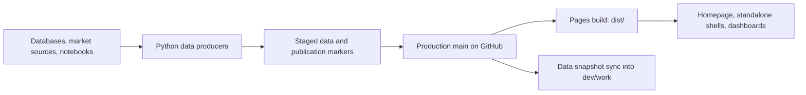

# Wicked Smart Bitcoin

[Live site](https://wickedsmartbitcoin.com) · [Repository](https://github.com/w-s-bitcoin/wickedsmartbitcoin)

Wicked Smart Bitcoin publishes interactive Bitcoin dashboards as a static website.
The browser reads committed CSV, JSON, binary, and JavaScript data files; separate Python
jobs produce and publish those datasets. You can work on the frontend using the
data already in a checkout, without a database or the production jobs.

For AI-assisted contributions, start with [AGENTS.md](AGENTS.md).
The detailed frontend guides are [js/js_README.md](js/js_README.md) and
[webapps/README.md](webapps/README.md).

## Run locally

From the repository root:

```bash
python3 -m http.server 8080 --bind 127.0.0.1
```

Open [the homepage](http://127.0.0.1:8080/),
[a standalone dashboard](http://127.0.0.1:8080/node_count.html), or
[the dashboard iframe directly](http://127.0.0.1:8080/webapps/node_count/dashboard.html).
The generic visualization shell is available at
[view.html#node_count](http://127.0.0.1:8080/view.html#node_count).

Use HTTP rather than opening HTML through `file://`, because dashboards fetch
data files. Python's local server does not reproduce GitHub Pages' clean-route
fallback; use `.html` URLs locally.

There is no npm install or JavaScript bundling step. Python 3.10+ and Git are
needed for the portable checks below; browser regressions also need Chrome or
Chromium. Some pages load fonts or chart libraries from external services.
Bitcoin Net Worth can request live quotes from Kraken. DCA Cost Basis uses a
public Coinbase BTC/USD price socket with REST fallbacks for its current valuation
on the dashboard and home page card. Published hourly price data is the fallback;
historical DCA purchases still come from published price files.
The DCA "Updated" time and block height refer to that published price
snapshot; receiving a live quote does not advance them.

## Architecture



The frontend uses ordinary HTML, CSS, and JavaScript. The homepage loads the
numbered `js/00_*.js` through `js/12_*.js` files in order; these scripts share
globals, so load order and shell DOM IDs are part of their interface.

`assets/image_list.json` supplies visualization metadata. Homepage bootstrap
code maps entries to dashboard embeds and previews. Each dashboard lives under
`webapps/<slug>/`, usually with `dashboard.html`, an application script,
a preview, and processed data. Root `<slug>.html` pages provide standalone
entry points. `view.html` is the generic shell and `404.html` supports
production clean routes.

Shared controls, chart helpers, export, theme/embedding behavior, and data
refresh live in `webapps/shared/`. Individual dashboards keep their own data
models and rendering code. Casascius uses `casascius_explorer.js` rather than
the usual `dashboard_app.js`; Quantum uses `standalone_app.js` for its
standalone controller.

### Data publication and refresh

A publication marker identifies a complete generation of data, often including
hashes of the exact payload files. Updaters publish payloads before their
markers. The browser prepares a candidate, validates it, rechecks its marker,
and only then installs it. Failed or superseded updates leave the last complete
generation visible.

Dashboard adapters use `webapp_data_auto_refresh.js`; homepage preview
adapters use `preview_shared.js`. Hidden previews can install data but defer
painting until visible. Theme and resize events render cached data. These
contracts preserve chart state and avoid reloads or flashing during updates.

### Repository map

| Path | Responsibility |
| --- | --- |
| `index.html`, `assets/styles.css`, `assets/homepage.css`, `js/` | Homepage, navigation, modal, preferences, published network snapshot |
| `<slug>.html`, `view.html`, `404.html` | Standalone pages and routing shells |
| `assets/` | Catalog, common imagery, shared published data and metadata |
| `webapps/shared/` | Shared dashboard and preview runtime |
| `webapps/<slug>/` | Dashboard code, previews, data, and producer scripts |
| `webapps/quantum_exposure/pipeline/` | Quantum research and snapshot production tools |
| `scripts/automation/` | Production hourly/onchain orchestration and Git deployment |
| `scripts/sync_main_data_to_dev.py` | Copies published data into the development worktree |
| `scripts/test_*.py` | Publication, Git synchronization, packaging, and browser regressions |
| `scripts/build_pages_dist.sh` | Creates the pruned static Pages artifact |
| `.github/workflows/` | Contributor checks and production Pages deployment |
| `dist/` | Generated Pages output; ignored by Git |

## Dashboards

| Route | Contents |
| --- | --- |
| `/node_count` | Node history and software/version distribution |
| `/bitcoin_dominance` | Bitcoin dominance and cryptocurrency market-cap comparisons |
| `/dca_cost_basis` | Bitcoin price and dollar-cost-average cost basis |
| `/dca_comparison` | Equal-budget DCA comparisons between assets |
| `/days_since_ath` | All-time highs, drawdown, and time since the last high |
| `/issuance_rate` | Bitcoin issuance and halving history |
| `/uoa` | Historical currency-pair comparisons in both directions |
| `/bip110_signaling` | BIP-110 and historical SegWit signaling |
| `/patoshi_pattern` | Early-block ExtraNonce patterns and Patoshi classifications |
| `/quantum_exposure` | Public-key exposure, supply breakdowns, and historical snapshots |
| `/casascius_explorer` | Physical coins/bars, mintage, redemption, and spend activity |
| `/bitcoin_net_worth` | Personal asset/liability tracking with local persistence and optional encryption |

Net Worth's personal records stay in browser storage or user exports. Do not
commit personal records or export files as dashboard fixtures.

## Production data jobs

Production orchestration is documented in
[scripts/automation/README.md](scripts/automation/README.md). These programs can
access local credentials, update datasets, commit, and push to GitHub. They are
not required to serve or test the frontend.

- The hourly runner updates shared Bitcoin metrics, Node Count, Dominance,
  DCA Cost Basis, DCA Comparison, UoA, Patoshi, and Casascius data.
- The onchain runner is called after block ingestion by the external
  `CoreToPSQL` pipeline. It handles signaling/top-KPI publication when
  applicable and issuance data. It takes priority over hourly deployment.
- Quantum has its own producer pipeline in this repository and is not part of
  the hourly runner.
- Historical animation cleanup and its disabled daily job remain external.

The production checkout normally uses `main`; the separate development
worktree uses `dev/work`. Production automation may amend its latest
`Update data` commit and push with a lease. The dev sync helper therefore
creates data snapshot commits instead of replaying that rewritten history.
It preserves unrelated development edits and defers updates that overlap dirty
data paths. This sync does **not** merge source-code changes from main.
Always inspect the current branch and worktree before Git operations.

## Validation

Run the portable contributor checks from the repository root:

```bash
bash scripts/check_project.sh
```

This runs dashboard contracts, shell syntax and whitespace checks, isolated
Git/deployment and Pages-build regressions, and publication-marker validation.
It does not contact production databases or run the production jobs. Pull
requests run these checks, and the Pages workflow runs them before building.

Use the narrower checks when working on a specific area:

| Change | Relevant command |
| --- | --- |
| Dashboard markup/shared wiring | `bash scripts/check_all_dashboards.sh` |
| One dashboard contract | `bash scripts/check_dashboard_contract.sh webapps/<slug>` |
| Dev data synchronization | `python3 -m unittest scripts.test_sync_main_data_to_dev` |
| Basic browser document loading | `bash scripts/smoke_dashboards.sh webapps/<slug>` |
| Refresh/state behavior | The matching browser regression below |

The smoke script is a document-load check; it does not establish chart or
refresh correctness. It excludes Casascius from its default run because that
dashboard has a different shell contract.

Browser regressions launch an isolated browser profile and local server. Set
`CHROME_BIN` if Chrome is not at the default macOS path:

```bash
CHROME_BIN=/path/to/chromium python3 scripts/test_stage1_refresh_atomicity.py
CHROME_BIN=/path/to/chromium python3 scripts/test_stage2_refresh_atomicity.py
CHROME_BIN=/path/to/chromium python3 scripts/test_stage3_incremental_refresh.py
CHROME_BIN=/path/to/chromium python3 scripts/test_stage4_live_refresh.py
node scripts/test_dca_live_price.mjs
CHROME_BIN=/path/to/chromium python3 scripts/test_dca_live_price_browser.py
CHROME_BIN=/path/to/chromium python3 scripts/test_homepage_preview_refresh.py
```

Read each script's docstring for targets and optional arguments. Run the suites
relevant to the change; a documentation edit does not need every browser test.
UoA producer-window tests additionally need pandas:
`python3 -m unittest scripts.test_uoa_refresh_windows` (skipped if pandas is unavailable).

To inspect the actual deployment artifact:

```bash
bash scripts/build_pages_dist.sh
python3 -m http.server 8081 --bind 127.0.0.1 --directory dist
```

The build replaces `dist/`. It copies browser assets, excludes pipeline code
and selected raw inputs, and removes large Quantum archive payloads while
keeping coherent empty archive catalogs. Compact historical snapshots remain;
the current snapshot retains its full address table. The source tree and the
Pages artifact intentionally contain different datasets.

## Adding a dashboard

Start with [DASHBOARD_TEMPLATE.md](DASHBOARD_TEMPLATE.md) and
[webapps/README.md](webapps/README.md), then run:

```bash
bash scripts/create_dashboard.sh example_dashboard "Example Dashboard"
bash scripts/check_dashboard_contract.sh webapps/example_dashboard
```

The generator creates starter files, including a manifest and a root redirect.
Complete the rendering, preview, data producer, catalog/bootstrap registration,
and standalone integration as needed. Follow an existing dashboard with similar
behavior and reuse shared controls and refresh helpers. Check packaging whenever
new runtime filenames or data dependencies are introduced.

## Donation

Lightning address: `wicked@primal.net`


## License

Wicked Smart Bitcoin is fully open source / FOSS.

Unless otherwise noted, all code, dashboard source, data update scripts,
generated dashboard data, and documentation in this repository are released
under the MIT License.

© 2025-2026 Wicked Smart Bitcoin.
