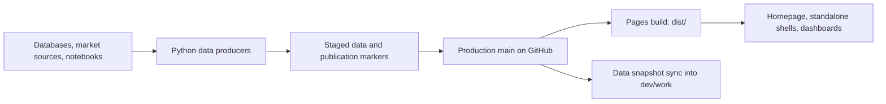

# Wicked Smart Bitcoin

[Live site](https://wickedsmartbitcoin.com) · [Repository](https://github.com/w-s-bitcoin/wickedsmartbitcoin)

Wicked Smart Bitcoin publishes interactive Bitcoin dashboards as a static website.
The browser reads committed CSV, JSON, binary, and JavaScript data files; separate Python
jobs produce and publish those datasets. You can work on the frontend using the
data already in a checkout, without a database or the production jobs.

For AI-assisted contributions, start with [AGENTS.md](AGENTS.md).
The detailed frontend guides are [js/js_README.md](js/js_README.md) and
[webapps/README.md](webapps/README.md).

**Quantum Exposure is deprecated and archived — 2026-10-06.** The dashboard
remains in the homepage grid with an Archived badge and at its direct URL,
with the frozen legacy snapshot at block **961000** and the
[archived findings](quantum_exposure_findings.html). No new Quantum snapshots
are scheduled, and the Quantum scheduler is not installed.

## Run locally

From the repository root:

```bash
python3 -m http.server 8080 --bind 127.0.0.1
```

Open [the homepage](http://127.0.0.1:8080/),
[a standalone dashboard](http://127.0.0.1:8080/node_count.html), or
[the dashboard iframe directly](http://127.0.0.1:8080/webapps/node_count/dashboard.html).
The generic visualization shell is available at
[view.html#node_count](http://127.0.0.1:8080/view.html#node_count).

Use HTTP rather than opening HTML through `file://`, because dashboards fetch
data files. Python's local server does not reproduce GitHub Pages' clean-route
fallback; use `.html` URLs locally.

There is no npm install or JavaScript bundling step. Python 3.10+ and Git are
needed for the portable checks below; browser regressions also need Chrome or
Chromium. Some pages load fonts or chart libraries from external services.
BTC/USD prices in DCA Cost Basis, Days Since ATH, DCA Comparison, Unit of Account,
and Bitcoin Net Worth use the public 2140data.io WebSocket. The 2140data.io
`/price` endpoint is the first REST fallback. DCA, Days, Comparison, and Unit of
Account retain their previous Coinbase socket and public REST sources as the
last fallback; Net Worth retains its previous Kraken calculation. Each accepted
quote recalculates the current
UTC day's modeled purchase and the rolling cost basis; earlier purchase prices
remain fixed. The last accepted quote stays visible through feed outages until a
newer hourly publication replaces it. A green dot means a quote arrived within
60 seconds; a gray dot marks a retained or published price. Published hourly data supplies historical
playback and animation frames; an export ending at the latest published date
captures the newest available quote for its final frame and hold. The DCA
"Updated" follows the accepted quote and displays the published snapshot's
block height alongside it.
Days Since ATH uses the same BTC/USD feed on its dashboard and home card. Its
daily-high history stays published; the highest quote observed in the open tab
can raise today's provisional high or set a new ATH, while the latest spot price
drives the current drawdown and chart guide.
Historical playback remains published, and an export ending at the latest day
captures one quote for its final frame and hold.
Bitcoin Net Worth also retains its last accepted price through an outage and
shows the latest published price when that snapshot is newer. Its quote status
turns gray after 60 seconds without an update.
DCA Comparison uses current BTC/USD and gold/silver quotes plus delayed public
quotes for SPY, QQQ, TLT, and MSTR. The selected assets' latest prices,
valuations, and chart update in an open tab; the home card updates its default
BTC/gold comparison. Equities are labeled with their feed delay (typically 15
minutes). If a feed drops, the tab retains its last quote with a gray status
dot until a newer published generation replaces it. Published daily prices
remain the historical source and the fallback on a fresh visit.
Unit of Account fetches USD quotes only for its selected pair. BTC uses the
shared spot feed, monetary metals use Gold API, and available fiat pairs use
indicative TradingView FX quotes. It calculates cross rates through USD and
updates the latest point in the open dashboard. Selected legs keep their
published value until a usable quote arrives; unsupported symbols stay on the
published snapshot. The Pair KPI shows each leg's quote status with a colored
dot; a dropped feed retains its last price until a newer publication wins.
Historical playback and exports use published data.

## Architecture



The frontend uses ordinary HTML, CSS, and JavaScript. The homepage loads the
numbered `js/00_*.js` through `js/12_*.js` files in order; these scripts share
globals, so load order and shell DOM IDs are part of their interface.

`assets/image_list.json` supplies visualization metadata. Homepage bootstrap
code maps entries to dashboard embeds and previews. Each dashboard lives under
`webapps/<slug>/`, usually with `dashboard.html`, an application script,
a preview, and processed data. Root `<slug>.html` pages provide standalone
entry points. `view.html` is the generic shell and `404.html` supports
production clean routes.

Shared controls, chart helpers, export, theme/embedding behavior, and data
refresh live in `webapps/shared/`. Individual dashboards keep their own data
models and rendering code. Casascius uses `casascius_explorer.js` rather than
the usual `dashboard_app.js`; Quantum uses `standalone_app.js` for its
standalone controller.

### Data publication and refresh

A publication marker identifies a complete generation of data, often including
hashes of the exact payload files. Updaters publish payloads before their
markers. The browser prepares a candidate, validates it, rechecks its marker,
and only then installs it. Failed or superseded updates leave the last complete
generation visible.

Dashboard adapters use `webapp_data_auto_refresh.js`; homepage preview
adapters use `preview_shared.js`. Hidden previews can install data but defer
painting until visible. Theme and resize events render cached data. These
contracts preserve chart state and avoid reloads or flashing during updates.

### Repository map

| Path | Responsibility |
| --- | --- |
| `index.html`, `assets/styles.css`, `assets/homepage.css`, `js/` | Homepage, navigation, modal, preferences, published network snapshot |
| `<slug>.html`, `view.html`, `404.html` | Standalone pages and routing shells |
| `assets/` | Catalog, common imagery, shared published data and metadata |
| `webapps/shared/` | Shared dashboard and preview runtime |
| `webapps/<slug>/` | Dashboard code, previews, data, and producer scripts |
| `webapps/quantum_exposure/pipeline/` | Quantum research and snapshot production tools |
| `scripts/automation/` | Production hourly/onchain orchestration and Git deployment |
| `scripts/sync_main_data_to_dev.py` | Copies published data into the development worktree |
| `scripts/test_*.py` | Publication, Git synchronization, packaging, and browser regressions |
| `scripts/build_pages_dist.sh` | Creates the pruned static Pages artifact |
| `.github/workflows/` | Contributor checks and production Pages deployment |
| `dist/` | Generated Pages output; ignored by Git |

## Dashboards

| Route | Contents |
| --- | --- |
| `/node_count` | Node history and software/version distribution |
| `/bitcoin_dominance` | Bitcoin dominance and cryptocurrency market-cap comparisons |
| `/dca_cost_basis` | Bitcoin price and dollar-cost-average cost basis |
| `/dca_comparison` | Equal-budget DCA comparisons between assets |
| `/days_since_ath` | All-time highs, drawdown, and time since the last high |
| `/issuance_rate` | Bitcoin issuance and halving history |
| `/uoa` | Historical currency-pair comparisons in both directions |
| `/bip110_signaling` | BIP-110 and historical SegWit signaling |
| `/patoshi_pattern` | Early-block ExtraNonce patterns and Patoshi classifications |
| `/quantum_exposure` | Archived Quantum research dashboard, frozen at block 961000 |
| `/casascius_explorer` | Physical coins/bars, mintage, redemption, and spend activity |
| `/bitcoin_net_worth` | Personal asset/liability tracking with local persistence and optional encryption |

Net Worth's personal records stay in browser storage or user exports. Do not
commit personal records or export files as dashboard fixtures.

Net Worth's title settings button controls the units offered in both valuation
and asset/liability dropdowns. Fresh preferences include USD, BTC, and sats;
additional currencies, cryptocurrencies, Bitcoin-related stocks, major ETFs, and metals
can be enabled individually. Stock and ETF amounts are share counts (including
fractional shares). Hiding a unit leaves existing holdings unchanged. These
controls also appear in the standalone `/bitcoin_net_worth` app. ETF choices cover
broad US/international equities, bonds, precious metals, and Bitcoin funds.

Crypto spot quotes use Coinbase and stock quotes use TradingView's public
scanner, with delays and retained prices labeled beside the dashboard. Only
units used by the view or holdings are requested. BTCFX uses CNBC's latest
daily NAV, labeled with its actual pricing date, and retains that price through
feed outages. Historical stock valuations
use dated saved prices, carried forward until another saved price is available;
they do not use split-adjusted comparison data. Enter a price for the selected
date with **Set a price** when needed. Unavailable prices show a dash in affected
totals and omit unpriced dates from charts. CSV and encrypted exports preserve
quantities, units, BTC/USD, and saved per-unit USD prices; older files still load.

For today's holdings, a manual Bitcoin price applies the same percentage change
to estimated MSTR and Bitcoin fund prices, including BTCFX and Bitcoin ETFs.
Other stocks and funds keep their own prices. Automatic or manually set share
prices serve as the base; saved quotes and history retain their original prices.
Totals, charts, filters, and share units of account use the estimates together.

UoA pair links accept `?pair=BTCEUR` on `/uoa` (or `/uoa.html` locally).
The first three letters select the primary account and the last three select
the secondary account. Both codes must be supported and distinct; the link
opens that pair even when a different pair was saved in the browser.

Copy Link on the analytics dashboards captures the complete view, including
default values, filters, selected series, units, scales, date/snapshot selection,
and paused playback position where supported. Opening a copied link takes
precedence over the recipient's saved dashboard settings. Links recreate the
view using the available published/live data; they do not freeze market quotes.
Bitcoin Net Worth retains its existing sharing and personal-data behavior.

## Production data jobs

Production orchestration is documented in
[scripts/automation/README.md](scripts/automation/README.md). These programs can
access local credentials, update datasets, commit, and push to GitHub. They are
not required to serve or test the frontend.

- The hourly runner updates shared Bitcoin metrics, Node Count, Dominance,
  DCA Cost Basis, DCA Comparison, UoA, Patoshi, and Casascius data.
- The onchain runner is called after block ingestion by the external
  `CoreToPSQL` pipeline. It handles signaling/top-KPI publication when
  applicable and issuance data. It takes priority over hourly deployment.
- The retired Quantum producer and its
  [operating guide](webapps/quantum_exposure/pipeline/OPERATIONS_V2.md) remain
  in the repository for historical reference. They are not part of the hourly
  runner or block ingestion.
- Historical animation cleanup and its disabled daily job remain external.

The production checkout normally uses `main`; the separate development
worktree uses `dev/work`. Production automation may amend its latest
`Update data` commit and push with a lease. The dev sync helper therefore
creates data snapshot commits instead of replaying that rewritten history.
It preserves unrelated development edits and defers updates that overlap dirty
data paths. This sync does **not** merge source-code changes from main.
Always inspect the current branch and worktree before Git operations.

## Validation

Run the portable contributor checks from the repository root:

```bash
bash scripts/check_project.sh
```

This runs dashboard contracts, shell syntax and whitespace checks, isolated
Git/deployment and Pages-build regressions, and publication-marker validation.
It does not contact production databases or run the production jobs. Pull
requests run these checks, and the Pages workflow runs them before building.

Use the narrower checks when working on a specific area:

| Change | Relevant command |
| --- | --- |
| Dashboard markup/shared wiring | `bash scripts/check_all_dashboards.sh` |
| One dashboard contract | `bash scripts/check_dashboard_contract.sh webapps/<slug>` |
| Dev data synchronization | `python3 -m unittest scripts.test_sync_main_data_to_dev` |
| Basic browser document loading | `bash scripts/smoke_dashboards.sh webapps/<slug>` |
| Refresh/state behavior | The matching browser regression below |

The smoke script is a document-load check; it does not establish chart or
refresh correctness. It excludes Casascius from its default run because that
dashboard has a different shell contract.

Browser regressions launch an isolated browser profile and local server. Set
`CHROME_BIN` if Chrome is not at the default macOS path:

```bash
CHROME_BIN=/path/to/chromium python3 scripts/test_stage1_refresh_atomicity.py
CHROME_BIN=/path/to/chromium python3 scripts/test_stage2_refresh_atomicity.py
CHROME_BIN=/path/to/chromium python3 scripts/test_stage3_incremental_refresh.py
CHROME_BIN=/path/to/chromium python3 scripts/test_stage4_live_refresh.py
node scripts/test_dca_live_price.mjs
CHROME_BIN=/path/to/chromium python3 scripts/test_dca_live_price_browser.py
node scripts/test_days_live_price.mjs
CHROME_BIN=/path/to/chromium python3 scripts/test_days_live_price_browser.py
node scripts/test_comparison_live_price.mjs
CHROME_BIN=/path/to/chromium python3 scripts/test_comparison_live_price_browser.py
CHROME_BIN=/path/to/chromium python3 scripts/test_networth_live_quote_browser.py
node scripts/test_networth_market_units.mjs
CHROME_BIN=/path/to/chromium python3 scripts/test_networth_units_browser.py
node scripts/test_uoa_live_quotes.mjs
CHROME_BIN=/path/to/chromium python3 scripts/test_uoa_live_quotes_browser.py
CHROME_BIN=/path/to/chromium python3 scripts/test_homepage_preview_refresh.py
node scripts/test_dashboard_share.mjs
CHROME_BIN=/path/to/chromium python3 scripts/test_dashboard_share_routes.py
CHROME_BIN=/path/to/chromium python3 scripts/test_time_series_share_browser.py
CHROME_BIN=/path/to/chromium python3 scripts/test_analytics_share_browser.py
CHROME_BIN=/path/to/chromium python3 scripts/test_specialized_share_browser.py
```

Read each script's docstring for targets and optional arguments. Run the suites
relevant to the change; a documentation edit does not need every browser test.
The archived Quantum browser tests remain available for explicit historical checks.
UoA producer-window tests additionally need pandas:
`python3 -m unittest scripts.test_uoa_refresh_windows` (skipped if pandas is unavailable).

To inspect the actual deployment artifact:

```bash
bash scripts/build_pages_dist.sh
python3 -m http.server 8081 --bind 127.0.0.1 --directory dist
```

The build replaces `dist/`. It copies browser assets, excludes pipeline code
and selected raw inputs, and removes large Quantum archive payloads while
keeping coherent empty archive catalogs. Compact historical snapshots remain;
the current snapshot retains its full address table. The source tree and the
Pages artifact intentionally contain different datasets.

## Adding a dashboard

Start with [DASHBOARD_TEMPLATE.md](DASHBOARD_TEMPLATE.md) and
[webapps/README.md](webapps/README.md), then run:

```bash
bash scripts/create_dashboard.sh example_dashboard "Example Dashboard"
bash scripts/check_dashboard_contract.sh webapps/example_dashboard
```

The generator creates starter files, including a manifest and a root redirect.
Complete the rendering, preview, data producer, catalog/bootstrap registration,
and standalone integration as needed. Follow an existing dashboard with similar
behavior and reuse shared controls and refresh helpers. Check packaging whenever
new runtime filenames or data dependencies are introduced.

## Donation

Lightning address: `wicked@primal.net`


## License

Wicked Smart Bitcoin is fully open source / FOSS.

Unless otherwise noted, all code, dashboard source, data update scripts,
generated dashboard data, and documentation in this repository are released
under the MIT License.

© 2025-2026 Wicked Smart Bitcoin.
