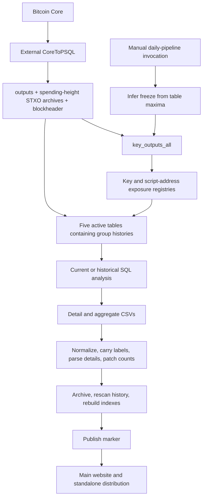

# Quantum Exposure: pipeline audit and redesign

**Audit date:** 2026-10-05. **Source revision:** `39f288a9af85d3ffa3bda77fc35a06dd1ac46246`.
**Status:** audit and proposed architecture; production implementation and scheduling are not installed.

The goal is balanced correctness, speed, and maintainability, with automatic
snapshots at every 1,000-block boundary without monopolizing the desktop.

**Recommendation: retain Python and PostgreSQL; replace repeated historical
reconstruction with bounded updates to compact analytical state.** Fix the
analytical inconsistencies before using the old output as a correctness oracle.
A whole-program Rust/C++ translation would leave the dominant SQL work intact.

- [Proposed architecture, automatic operation, and migration](REDESIGN.md)
- [Draft logical PostgreSQL schema](schema_v2_proposal.sql) — design only, not a migration
- [Live catalog evidence](evidence/database_2026-10-05.json)
- [Non-executing spend-range query plan](evidence/spend_range_plan.json)
- [Snapshot and parser reproductions](evidence/snapshot_checks.json)
- [Archive merge reproduction](evidence/archive_merge.json)
- [Identity-input enumeration](evidence/identity_enumeration.json)

## Scope and evidence limits

Reviewed the 21 Python/shell pipeline files, related shell tools, methodology, frontend data loading,
publication marker validation, archive/index/enrichment helpers, standalone
synchronization, Pages packaging, and related tests. Also inspected the actual
external CoreToPSQL ingestion/archive/reorg code, its blocknotify wrapper,
current cron, and user LaunchAgents. The owner confirms Quantum is manually
triggered; the inspected callers do not schedule it.

The database inspection used read-only transactions with short timeouts and
catalog queries. One `EXPLAIN` was taken **without ANALYZE**, so it did not execute
the underlying query. No production producers, rebuilds, migrations, scheduler
changes, data edits, or publication were performed. Reproduction scripts read
existing files or execute isolated pure functions. Row counts below are planner
estimates, not exact counts; table/index bytes are catalog measurements.

No stage runtime trace exists from this audit. `pg_stat_statements` is not
installed, `shared_preload_libraries` is empty, and `track_io_timing` is off.
The audit therefore establishes structural waste and specific incorrect outputs,
not a measured end-to-end speedup or a promised completion time.

## What runs today



The shell starts five SQL-producing processes in phase 2 and three in phase 3.
The analysis stages already use PostgreSQL for the substantial joins, grouping,
hashing, and sorting. Current and historical analyzers use REPEATABLE READ;
current analysis also checks that the active-table heights agree. Those are
useful protections to preserve. Earlier builders use independent default
READ COMMITTED transactions and a shared height-only checkpoint table.

## Measured scale

The host has an Apple M4 Max, 16 CPU cores, and 128 GiB RAM. At inspection,
PostgreSQL 14.15 held about 3,453 GiB across the database, with roughly 2.5 TiB
available on the host data volume. This is shared capacity, not a Quantum budget.

| Derived table | Estimated rows | Table/TOAST GiB | Index GiB | Total GiB |
| --- | ---: | ---: | ---: | ---: |
| `key_outputs_all` | 2,408,078,592 | 499.20 | 516.99 | 1,016.20 |
| `active_key_outputs` | 470,830,944 | 198.65 | 144.18 | 342.83 |
| `exposed_keyhash20` | 990,734,720 | 55.85 | 56.93 | 112.78 |
| `active_p2tr_outputs` | 177,014,784 | 40.88 | 59.76 | 100.63 |
| `active_p2sh_outputs` | 68,933,576 | 33.15 | 29.04 | 62.19 |
| `exposed_p2sh_address` | 383,055,456 | 27.63 | 31.02 | 58.65 |
| `active_p2wsh_outputs` | 14,849,721 | 4.93 | 5.28 | 10.21 |
| `exposed_p2wsh_address` | 37,901,992 | 3.58 | 4.31 | 7.89 |
| `active_bare_ms_outputs` | 2,520,456 | 0.41 | 1.35 | 1.76 |

These derived tables alone occupy **1,713.13 GiB**, in addition to source tables.
Do not plan another full copy of all facts as the first migration step.

At the catalog sample, `blockheader` was at **970022**, all ten Quantum freeze
rows were at **962000**, and this checkout's published marker identified
**961000**. This difference requires reconciliation before automation; the
checkpoints alone do not establish whether the 962000 release completed.

The session defaults are `work_mem=512 MiB`, eight workers per parallel gather,
16 total parallel workers, and 32 GiB shared buffers. `work_mem` is a limit per
operation, not per connection; concurrent sorts/hash operations and workers can
multiply it. A low-priority Python process does not limit the independent
PostgreSQL server processes. [PostgreSQL resource documentation](https://www.postgresql.org/docs/14/runtime-config-resource.html).

The following real query shape from changed-key discovery was planned as a
**parallel sequential scan of `key_outputs_all`, with eight workers**:

```sql
EXPLAIN (FORMAT JSON)
SELECT keyhash20 FROM public.key_outputs_all
WHERE spendingblock > 961000 AND spendingblock <= 962000;
```

This is planner evidence, not measured execution. Live indexes include
`(keyhash20, spendingblock)` but no spending-height-leading index. That composite
index helps a known key's history; it does not make this global range lookup
cheap. Prefer consuming the batch's spend events directly. An additional large
index is an interim option only after evaluating its build space, write cost,
and representative query plans.

## Prioritized findings

Paths and line numbers refer to the source revision above. Pipeline filenames
are relative to the parent of this directory. **Reproduced** means an existing
artifact or isolated function demonstrates the problem; **source risk** means
the code permits it but the audit did not establish that it occurred in a live run.

### P1 — correctness and recoverability

1. **Detail and aggregate eligibility/activity differ — reproduced.**
   `run_dashboard_analysis.py:776–804` computes per-group/per-script rows;
   `841–859` combines scripts before the detail balance threshold, but `2185`
   applies aggregate thresholds separately to each script. Activity is likewise
   per script in the base and merged in details. A 0.6 BTC P2PK + 0.6 BTC P2PKH
   group enters details at ≥1 BTC but neither slice passes the aggregate test.
   `correct_aggregated_pubkey_counts.py:132–156,196–210` changes counts only;
   it cannot reconcile the amounts, UTXOs, or eligibility.

   At 961000, the detail sum is **690,310,766,949,019 sats / 7,691,828 UTXOs**;
   aggregate `ge1/All/all` is **690,303,223,537,713 sats / 7,562,231 UTXOs**.
   The discrepancy is **75.43411306 BTC / 129,597 UTXOs**. The CSV check proves
   disagreement; the branching SQL semantics explain a mechanism, not an
   attribution of every discrepant row. Use one canonical eligibility/activity
   relation before deriving either display.

2. **Historical last-spend dates contain a sentinel — reproduced.**
   `run_historical_dashboard_analysis.py:795–817` substitutes height 1 for an
   unresolved script-hash spend. The exporter joins it to block 1's timestamp.
   Snapshot 850000 has 3,354 such rows holding 43,196.90884687 BTC; 500000 has
   387 holding 15,708.22053099 BTC. The shortcut may preserve one-year inactivity
   but does not support exact dates or the adjustable 1–10-year filter. Store
   exact spend history or explicitly unknown evidence; never a fictional height.

3. **First exposure is backdated to funding — source-confirmed semantics.**
   `run_dashboard_analysis.py:780` and historical `869–988` take the minimum
   creation height of currently exposed rows. A key disclosed at 200 for an
   output created at 100 can therefore show 100. Separate first funding, first
   disclosure, and first exposed-balance event. Exposure requires disclosure
   evidence available at the requested height.

4. **Disclosure and public-key identity are incomplete — model limitation.**
   `run_exposed_keyhash20.py:105–137` uses P2PK funding and key-output spends.
   Public keys revealed in other script contexts do not feed this registry.
   HASH160 of serialized keys also does not globally deduplicate curve points.
   A spent script-hash address is a heuristic, not proof that every associated
   policy has an immediately usable quantum spending path. Preserve separate
   metrics for reporting groups, exact disclosed keys, recognized attack paths,
   and unresolved scripts. Version any expansion so historical numbers do not
   silently change meaning. See the policy/evidence design in REDESIGN.md.

5. **Multisig parser accepts invalid key structures — reproduced.**
   `run_dashboard_analysis.py:1451–1505` accepts `5151ae` (no key),
   `51010151ae` (one-byte key), and a 33-byte all-zero pushed key as 1-of-1.
   These fixtures establish permissive parsing, not their frequency in real
   exports. `2062–2066,2313–2315` also lets a cached negative label persist.
   Use typed parse results and versioned validation, including curve validity;
   distinguish unsupported, absent, and malformed policies.

6. **Source consistency and reorg recovery are incomplete — source risk.**
   `run_key_outputs_all.py:93–160` stores heights and infers completeness from
   maxima. The external `/Users/wicked/Projects/onchain/01 - CoreToPSQL.py:866`
   can commit spent rows before archival at `916`; archive movement at `659–669`
   is transactional. Root builder `284–312` and historical loader `401–444`
   treat live `outputs` rows as unspent. With READ COMMITTED, a multi-query
   reader can also observe rows before and after source movement. Source reorg
   rollback (`716–791` externally) does not invalidate Quantum's checkpoints.
   Require a committed source watermark with block hash and a coherent source
   snapshot/event batch. PostgreSQL documents the statement-by-statement
   snapshots of READ COMMITTED versus REPEATABLE READ in its
   [transaction isolation reference](https://www.postgresql.org/docs/14/transaction-iso.html).

7. **Lagged freeze recovery can omit UTXOs — source risk.**
   Root `315–344` and active-script `240–255` reconstruct some unspent-at-H rows
   only from the latest archive. A later spend can reside in a nonlatest archive
   when H is sufficiently old. Every archive intersecting spending heights >H
   must be eligible for reconstruction. Test freeze catch-up across 100,000-block
   archive boundaries; do not generalize the near-tip path to arbitrary history.

8. **Failed releases can be skipped — source risk.**
   `run_daily_snapshot_pipeline.py:169–185,354–355` schedules from any directory
   with a full CSV, before enrichment, validation, publication, and standalone
   sync (`404–475`) complete. Failure after export advances the next target;
   a failed destination sync has no independent retry ledger. Use persistent
   phase and destination status; resume an incomplete target first.

9. **Archived rows are dropped in historical merging — reproduced.**
   `dashboard_app.js:3374–3384,6768–6774` checks snapshot existence while adding
   rows. The first archived row makes later rows of that same snapshot look
   duplicate. The isolated real refresh parser retains 2/2 active rows but only
   1/2 archived rows. Capture active heights before the merge. This affects
   archive-enabled distributions; Pages intentionally omits archives.

10. **Archived labels receive double voting weight — reproduced.**
    `sync_identity_consensus_from_snapshots.py:158–173,194–209` recursively scans
    the data root and then its archived child. This machine lists 121 files but
    only 71 unique ones: all 50 archives occur twice. These are also historical
    copies of attribution, not independent evidence. Replace majority voting
    over exports with versioned attribution records and explicit precedence.

11. **Manifest coverage is incomplete — source-confirmed limitation.**
    `publish_generation.py:696–704` hashes `historical_eco.csv` only. The dashboard
    discards even this artifact evidence (`dashboard_app.js:6784–6801`). Its
    preparation uses schema/coverage heuristics (`dashboard_app.js:6565–6569,
    6646–6654,7111–7208`); same-shaped stale or incorrect values can pass.
    Publisher `420–448,478–504` checks membership/filter keys more strongly than
    value equivalence. Hash and version all required artifacts and reconcile
    top-100/detail/aggregate values before publishing. Retain marker-last and
    prepare → validate → marker recheck → commit, which already work well.

12. **Historical output override is not isolated — source risk.**
    `run_historical_dashboard_analysis.py:1857–1865` invokes regeneration without
    its custom output root, even with the main postprocess skip flag. Regeneration
    uses the default root (`regenerate_snapshot_indexes.py:14–15`). Fix this before
    executing a shadow build; `--out-dir /tmp/...` alone is not isolation.

### P1/P2 — efficiency and operability

13. **Active tables repeatedly copy historical rows.**
    `run_active_key_outputs.py:293–344` deletes every row for a changed group and
    reinserts its history if any UTXO remains. Script families do the equivalent
    (`run_active_script_hash_outputs.py:264–347,453–464`). Replace this with
    current UTXO state and compact group summaries, retaining history once.

14. **Incremental jobs still scan entire large tables for reporting.**
    Root `423–440,520–522` performs full COUNT/DISTINCT summaries; exposure and
    active builders also run full counts and ANALYZE before completion. Five
    simultaneous branches amplify reads, temp work, and memory. Use exact batch
    counters plus separately budgeted full reconciliation. Do not remove useful
    statistics maintenance indiscriminately; schedule it based on changes.

15. **Historical work scales with snapshots × reconstructed history.**
    Historical `996–1104,1832–1865` rebuilds a large temporary world and three
    indexes per requested height. Replay once chronologically and emit boundary
    snapshots from evolving state, including time-based activity transitions.

16. **P2PK cache writes roll back in current analysis.**
    `run_dashboard_analysis.py:470–607` writes a persistent cache, but `2611–2823`
    closes without committing. Historical code does commit. Make the cache an
    explicit versioned derivation with a separate bounded write transaction;
    keep snapshot export reads stable and read-only.

17. **Enrichment repeatedly scans old files and current rows.**
    Current analysis `1035–1120,1211–1271` carries labels from every previous CSV,
    repeatedly fetching current details. Other helpers rescan active/archive
    exports; regeneration `109–120` materializes a full CSV before deciding its
    time columns already exist. File sizes imply roughly 5.51 GB of logical CSV
    input across daily postprocessing passes, before more rewrites/sorts. This is
    not measured physical I/O. Join canonical labels once during streaming export.

18. **Bulk Python materialization adds avoidable memory.**
    Current analysis `257–333,2266–2278` holds whole datasets and transformed
    copies. Use streaming cursors/bounded transforms or PostgreSQL
    [COPY](https://www.postgresql.org/docs/14/sql-copy.html); compute top-100 in SQL
    or with a bounded heap. Profile residual parsing before choosing native code.

19. **Schema provisioning and indexes are not reproducible.**
    Some builders create a table but require a manually seeded checkpoint
    (`run_key_outputs_all.py:469–473`, exposure-key `154–158`). Useful live root
    indexes are absent from its checked-in CREATE TABLE routine. There are also
    candidate overlapping indexes, such as standalone address and address/height
    indexes on active P2TR/bare tables. Introduce migrations and bootstrap state;
    remove indexes only with workload evidence, not name similarity alone.

20. **Orchestration has no run owner or fail-fast recovery contract.**
    The daily runner/shell lacks a global run lock and durable phase state. Shell
    `27–46` waits in launch order before cancelling remaining children. Regeneration
    catches some required-output errors (`195–196,246–247,385–387,466–469`) and can
    finish successfully. Use one writer, recorded attempts, prompt cancellation,
    and failure propagation. Keep publication and destination retries separate.

### P2 — methodology, delivery, and frontend

21. **Migration-size estimates need explicit scenario semantics.**
    Current constants (`run_dashboard_analysis.py:42–53`), SQL multisig formulas
    (`2147–2157`), and methodology descriptions are not a single precise model.
    Mixed rows lack exact per-script input counts; a 10,000-input ceiling permits
    model transactions larger than block capacity. Historical aggregates precede
    newly parsed details (`run_historical_dashboard_analysis.py:1636–1650`).
    Define versioned scenarios, serialized weight formulas, feasible transaction
    limits, and uncertainty. A chosen transaction packing model is not evidence
    for an unqualified lower-bound claim. Bitcoin's weight definition is in
    [BIP141](https://github.com/bitcoin/bips/blob/master/bip-0141.mediawiki).

22. **Explicit full-data loading needlessly parses the whole height/time lookup.**
    `dashboard_app.js:5667–5685` loads a 24.1 MB full CSV and 18.2 MB lookup,
    formatting roughly 962,000 height timestamps on the main thread. Exports
    already carry timestamps and tooltips prefer them (`5478–5490`). Remove that
    normal-path lookup; retain a bounded legacy fallback. Preserve the useful
    top-100 first render, only 13,972 bytes at 961000. Profile before adding a
    worker/chunked search; avoid replacing the simple static-site architecture.

23. **Standalone runtime copies can drift.**
    Daily runner `247–305` copies only a subset of dashboard dependencies and
    recopies every active snapshot. HTML imports more shared assets, and
    `identity_groups.json` is fetched separately. Use a dependency/capability
    manifest with hash-based copying and destination validation.

24. **Publication/archive/build lifecycle does unnecessary work.**
    Archiving moves directories before catalogs finish; the current generation
    is protected but selected older URLs may disappear. Pages build `61,74–75,
    102–103` copies data before pruning it. Use immutable generation paths and
    build from allowed artifact lists, preserving intentional public/archive
    differences. Local data totals 1.498 GB including ignored archives/enrichment;
    that is not the public deployment size.

25. **Bare multisig without an address may be omitted — unmeasured coverage.**
    `run_active_bare_ms_outputs.py:94–103,159–168,211–223` requires addresses while
    downstream analysis has an outpoint fallback (`run_dashboard_analysis.py:711–719`).
    Measure source incidence in an isolated sample; use script identity for
    addressless policies. Do not claim a quantified undercount from code alone.

## Reproduce the bounded checks

Run from the repository root. These commands report observations; a zero exit
means the audit ran, **not that current output is correct**. The CSV fixtures are
the existing selected snapshots; no production producer is imported.

```bash
python3 webapps/quantum_exposure/pipeline/audit/verify_quantum_snapshot_audit.py --data-dir webapps/quantum_exposure/webapp_data
node webapps/quantum_exposure/pipeline/audit/verify_quantum_archive_merge.mjs --app webapps/quantum_exposure/dashboard_app.js
python3 webapps/quantum_exposure/pipeline/audit/verify_quantum_identity_enumeration.py --data webapps/quantum_exposure/webapp_data
psql -X -w -qAt -d bitcoin_data -f webapps/quantum_exposure/pipeline/audit/collect_database_evidence.sql
```

The catalog collector does not contain credentials. It expects the operator's
normal local PostgreSQL access and an explicitly selected database. Review its
table names before using it elsewhere. The draft schema belongs only in a
disposable database for review; it is not a production migration command.

## Validation performed

All three reproduction commands completed and reproduced the documented issues.
The proposed DDL was accepted by an isolated PostgreSQL 14.15 instance; seven
versioning/retry/constraint checks passed, rollback removed the proposed schema,
and the temporary instance was shut down. The existing fixture-based
`python3 scripts/test_quantum_publication_marker.py` regression passed. This
establishes existing publication-test compatibility, not analytical correctness.
See [validation evidence](evidence/validation.json). No implementation speedup or
desktop resource target has been benchmarked yet.
