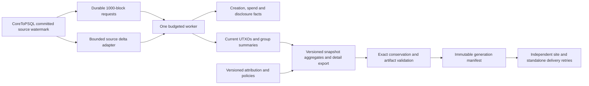

# Quantum Exposure v2: proposed architecture

This design responds to the [2026-10-05 audit](README.md). It is an implementation
plan, not a deployed replacement. Its first delivery is reliable, inexpensive
automatic snapshots every 1,000 blocks; a normalized historical warehouse and
expanded key-disclosure coverage follow behind separate validation gates.

## Decisions

| Area | Decision | Reason |
| --- | --- | --- |
| Orchestration | Python, small explicit CLI modules | Existing integration is adequate; changing language does not change SQL cost |
| Operational data | PostgreSQL | Transactions, exact integers, existing source and indexed state are useful |
| Routine processing | Bounded creations/spends/disclosures plus compact state | Work should follow changed facts, not rewrite all history of active groups |
| Historical rebuild | One chronological replay with checkpoints | Emit many snapshots without rebuilding every intermediate world |
| Native code | Optional isolated parser/decoder after profiling | A concrete CPU-bound component can justify Rust; no whole-program rewrite |
| Analytical storage | Reuse source facts first; normalize selectively later | Avoid another multi-billion-row copy before benefit and space are demonstrated |
| Browser | Static compatible exports and compact-first rendering | No new application server or frontend framework is needed |
| Publication | Immutable generation manifests and durable delivery state | Exact provenance, validation, retry, and rollback |
| Automatic trigger | Separate worker with periodic readiness check | Ingestion remains responsive; missed notifications cannot lose a boundary |

Rust would be reasonable for a validated script/key parser or binary block
decoder if CPU profiling identifies it as a substantial residual cost. C++ adds
no demonstrated advantage for this orchestration. Columnar files/DuckDB may be
useful later for offline immutable research; ClickHouse or another service is
not justified by this audit. Neither alternative removes the need for chain
identity, exact disclosure semantics, or incremental processing. Benchmark any
additional engine on the actual workload before adopting it.

## Target flow



The draft [SQL schema](schema_v2_proposal.sql) describes the logical destination.
It deliberately does not apply to live tables, partition the entire existing
database, or implement the worker. Migrations, adapter code, exporter, scheduler,
and recovery logic are implementation work. A rollback wrapper allows syntax
review in a disposable database; it is not an invitation to run DDL in production.

## 1. Define the analytical contract first

**Canonical accounting unit:** an output occurrence, identified by creation
block identity plus txid and vout. Store amounts/counts as integers. A txid/vout
pair alone is insufficient for all historical occurrences; preserve the
duplicate-transaction cases described in
[BIP30](https://github.com/bitcoin/bips/blob/master/bip-0030.mediawiki).

For a canonical target height H:

```text
unspent(o,H) = o is in the modeled canonical UTXO accounting universe
               and o.created_height <= H
               and no canonical spend or consensus overwrite/removal at or before H
exposed(o,H) = unspent(o,H) and policy_evidence(o,H,methodology_version)
```

Define the supply denominator explicitly, including genesis, provably unspendable
outputs, lost rewards, and historical duplicate-transaction overwrite removals.
Occurrence identity preserves evidence but does not itself remove an overwritten
original from the UTXO set. Keep this accounting policy consistent across totals.

Keep first received height, first disclosure height, and first exposed-balance
height distinct. For a previously funded key-hash output, exposure starts no
earlier than both its creation and the relevant disclosure, while it is still
unspent. A key disclosed while its previous balance is zero remains known if
the key receives new outputs later. Do not discard this knowledge with inactive
group state. Preserve exact last-spend events for historical predecessor
queries; unknown evidence remains NULL with a quality flag.

Use group-wide balance/activity for eligibility, matching the detailed dataset's
intended semantics. Compute that once **before** selecting script slices:

1. Sum each group's current balances across its script families.
2. Determine that group's last canonical spend at or before H and its activity.
3. Select eligible groups for the requested balance/activity filter.
4. Sum selected script-family exposure amounts and exact UTXO counts.

Export current balance as well as exposed balance, and both amount and UTXO
count by script family. This allows the browser and SQL to implement the same
filter semantics. Do not infer input counts by assuming one P2PK output in a
mixed group. All totals/top-100/detail/historical cubes derive from this same
relation; remove corrective CSV count patching.

Keep three different concepts explicit: a reporting group, a cryptographic key,
and an attributed owner. Multisig keys must not multiply the output's BTC amount.
Count distinct disclosed keys separately from exposed outputs/groups; all-script
key counts are set unions, not sums of family counts. The legacy address/keyhash
group count should retain a clearly named version for comparison.

**Exposure coverage:** keep legacy script-address heuristics as versioned
heuristics while adding verified key and recognized policy evidence. Redeem and
witness scripts disclose conditions, which can contain keys, thresholds,
hashlocks, and timelocks; a script disclosure is not by itself a universal attack
proof. This distinction follows from the actual spending rules in
[BIP16](https://github.com/bitcoin/bips/blob/master/bip-0016.mediawiki) and
[BIP141](https://github.com/bitcoin/bips/blob/master/bip-0141.mediawiki).

Preserve original serialized keys and map valid compressed/uncompressed forms
to the appropriate curve point. X-only keys require explicit interpretation;
Taproot's output key and internal key are different roles. Do not merge them by
display address or assume every revealed policy is the only spending path.
Validate that any extracted redeem/witness script or Taproot path is actually
committed to the spending output; recognizing a script-shaped arbitrary witness
item is not enough. Use the rules in [BIP340](https://github.com/bitcoin/bips/blob/master/bip-0340.mediawiki)
and [BIP341](https://github.com/bitcoin/bips/blob/master/bip-0341.mediawiki).
This is a proposed inference/evidence model, not a claim of complete script
satisfiability analysis. Unsupported conditions remain visible as uncertainty.

The recent retention migration dropped some standard-key and Taproot spend
payloads. Exact cross-context key coverage cannot be recovered from keyhashes
alone. Capture minimal disclosure evidence before payload retirement going
forward; historical expansion may require a bounded Core/raw-block reread.
Do not reverse the retention migration by restoring every large witness column.

**Migration effort:** separate scenario version from exposure classification.
Specify destination script, signature model, transaction overhead, fee/space
allocation assumptions, input policy and transaction weight bounds. Calculate
weight from independently serialized fixtures, then pack feasible transactions
and blocks. Keep unsupported-policy ranges explicit. Recompute scenario results
without reparsing the chain or relabeling historical evidence.

## 2. PostgreSQL responsibilities

| Logical relation | Grain and purpose | Initial deployment |
| --- | --- | --- |
| Source watermark | Committed height/hash, source generation, archive completeness | Add to ingestion completion contract |
| `chain_block`, checkpoints | Canonical identity, parent linkage, processed frontier | Small control schema |
| Requests, runs, steps, delivery | Target/version identity, retries, cursors, destination receipts | Small control schema |
| Existing source outputs/STXOs | Creation and spending facts, retained scripts | Reuse through a tested adapter |
| `analysis_group`, `group_state` | Group identity and one summary per group/family | Seed in bounded chunks at a verified anchor |
| Current UTXO projection | Only unspent outputs needed for delta/accounting | Choose source-backed or sidecar after sizing |
| Disclosure registry/events | Earliest known evidence plus provenance and reorg identity | Retain existing knowledge, add event capture |
| Labels and parser results | One versioned attribution/parse result, independent of snapshots | Replace scans of exported CSVs |
| Snapshot aggregates/details | Results for one run and methodology/scenario/label revision | Immutable export plus small metadata |
| Narrow `output_fact`/`spend_event` | Optional future normalized history | Deferred until measured benefit justifies copying |

Compact state can still contain many millions of groups. Measure its actual
cardinality, row width, indexes, WAL, and bootstrap workspace; it is not assumed
to fit in RAM. Keep data in PostgreSQL and stream bounded batches to Python.
The existing billion-row exposure registry cannot simply be deleted when the
active tables shrink: it records disclosures needed by future re-receipts.

The draft current-state tables represent one active methodology/parser projection.
Queries must select its grouping version explicitly. A changed methodology uses
a separate shadow projection/schema and verified swap; do not mix versions by
updating rows in place. Past results remain in immutable versioned snapshots.

Index access paths, not every column: event height for incremental reading;
output occurrence for spends; script/key aliases for disclosure fanout;
group/family for updating state; group/height for historical activity. BRIN can
be evaluated for append-correlated facts; B-tree is appropriate for selective
lookups. Do not add wide covering indexes containing script payloads everywhere.
Record migrations for any selected indexes and their intended queries.

Physical partitioning is secondary. Existing STXO ranges are spending ranges,
not creation ranges. A declarative spend-event table partitioned by spending
height can eventually replace filename-driven scans; creation facts can have
different partitioning. PostgreSQL partitioned uniqueness must include the
partition key, which changes primary/foreign-key design. The unpartitioned
logical draft is not a claim that a global output ID remains enforceable after
adding arbitrary partitioning. [PostgreSQL partitioning constraints](https://www.postgresql.org/docs/14/ddl-partitioning.html).

Attribution should record subject, label, source, confidence/precedence,
observation time and revision. Import unique legacy evidence once. Retroactive
labels are allowed by existing methodology, but store label revision separately
from historical chain facts. A label correction can publish a new generation
at the same height without replaying the chain. Parser results are keyed by
script hash and parser version, with recognized/unsupported/invalid status.

## 3. Ingestion boundary and incremental algorithm

Add a readiness watermark only after all source work required by Quantum is
committed. Ideally write it in the same transaction as the corresponding final
source changes, and invalidate it on source rollback. A queue notification is
only a wake-up hint; durable readiness and request state remain authoritative.

Until immutable source event batches exist, extract each bounded range under
one coherent source snapshot. The adapter must read both live and archived
locations, honor actual spending heights/flags, and deduplicate by occurrence.
Do not assume every `outputs` row is unspent. For any cross-session extraction,
use one exported snapshot correctly or immutable batches; independently opening
REPEATABLE READ sessions does not give them the same snapshot.
PostgreSQL provides [snapshot export/import](https://www.postgresql.org/docs/14/functions-admin.html#FUNCTIONS-SNAPSHOT-SYNCHRONIZATION).

Avoid holding a multi-day database snapshot for historical rebuilding. Materialize
small verified input batches or use a consistent backup/replica for bootstrap.
Long reader transactions can interfere with cleanup even when they do not take
exclusive locks. Source hash checks at the start and before publication remain
necessary because a repeatable snapshot alone cannot detect a later reorg.

Process each batch in block/transaction order, including creation and spending
inside the same batch. In one projection transaction:

1. Verify source generation, parent hash, and expected processed frontier.
2. Insert idempotent creation/spend/disclosure facts or validated source references.
3. Add/remove only changed current UTXOs; apply exact integer deltas to group state.
4. On newly disclosed keys/policies, find matching current scripts and update their
   exposure. Disclosures can fan out to old outputs; this is legitimate work,
   measured and paginated instead of hidden in an unbounded history rewrite.
5. Store before-images or equivalent reversible deltas for changed projection rows.
6. Advance the processed checkpoint atomically with successful state changes.

Use uniqueness on source occurrence/event identity for retries. Never increment
a balance again merely because a worker restarted. Update the state of an output
created and spent in the same batch exactly once for each event.

Maintain aggregate bucket deltas from each group's old and new complete state.
Balance changes can move an entire group across tier boundaries. Activity can
change even with no new transactions, so process inactivity-threshold crossings
at snapshot time. Preserve exact last-spend time and evaluate configurable year
thresholds consistently; do not assume raw block timestamps are monotonic. A
small scheduled transition index or a bounded state pass is acceptable after
measurement. Correctness takes precedence over claiming every operation is O(delta).

For historical requests, replay once from a verified checkpoint and emit all
requested boundaries. Work is approximately source events plus affected groups,
disclosure fanout, activity transitions and emitted snapshot bytes. Full detail
exports still cost at least their output size. Do not promise constant time.

**Reorg:** compare hash ancestry, find the common ancestor, reverse affected
projection batches to a verified checkpoint, mark orphan runs/requests, then
replay the new chain. Events remain identifiable by block hash. A reorg deeper
than retained undo triggers a rebuild from an older verified checkpoint and
holds publication. Do not preserve a height-only checkpoint on a different chain.

The initial reproducible series uses evidence on the canonical chain at H,
matching its explicitly named scope. Orphaning a block does not make its revealed
keys secret again. Retain orphan disclosure evidence and collection provenance;
a broader publicly-observed-exposure series needs separate observation-time
semantics and a methodology version. Do not silently equate the two series or
delete real disclosure knowledge during canonical state rollback.

## 4. Automatic 1,000-block processing with desktop limits

Use a separate user LaunchAgent/coordinator that checks readiness about once
per minute, plus an optional lightweight ingestion notification. Ingestion
must not synchronously invoke the heavy analysis. The coordinator exits cheaply
when no work is due; it does not repeatedly launch the old full-table pipeline.

With confirmation depth D, the newest eligible target is:

```text
floor((committed_source_height - D) / 1000) * 1000
```

Use D=6 as an initial configurable proposal: snapshot H describes exactly H,
and becomes eligible after H+6 is committed. This is a modest delay, not proof
against reorgs. D=0 remains possible with the same hash/recovery safeguards.
Queue every missing boundary after the accepted automation anchor through the
newest eligible target; preserve deliberate gaps in older compact history. Process the
earliest incomplete target first, one at a time. A restart, sleep, or missed
notification must not skip boundaries or run parallel catch-up jobs.

The owner confirmed manual operation to date. Before enabling the agent,
reconcile published 961000 versus derived 962000, verify artifacts/chain identity,
and record the explicit completed anchor. Do not assume either the newest
directory or all matching table heights proves a validated release.

Use one PostgreSQL advisory lock for projection ownership and durable step
state/cursors for restart. Separate request, attempt, projection frontier,
validated snapshot and destination-delivery states. An analysis success followed
by a failed Git push must retry delivery without rerunning analysis. A partial
export must resume/rebuild that target, not schedule target+1000 as if it succeeded.
An unavailable standalone destination can remain pending while later analysis
continues within a configured backlog/free-space limit; analysis completeness
and delivery completeness are separate frontiers.
Record error category, bounded retry/backoff, last successful generation, and
the currently running phase. Do not store credentials in status or logs.

Starting policy for this 128 GiB / 16-core host, to be calibrated by trials:

| Control | Initial setting | Meaning |
| --- | --- | --- |
| Concurrent Quantum targets | 1 | No parallel catch-up fan-out |
| Heavy SQL sessions | 1 | Avoid five simultaneous scans |
| PostgreSQL parallel gather | 0 workers | One backend for routine queries |
| Session `work_mem` | 32 MiB | Limit each sort/hash operation; not total process RAM |
| Session temp-file budget | 2 GiB | Fail/reduce batch if spill exceeds configured budget |
| Lock timeout | 2 seconds | Yield/retry instead of waiting on ingestion locks |
| Statement timeout | 5 minutes initially | Cancel a runaway batch, rollback, shrink or diagnose |
| Batch target | 10–25 blocks initially | Tune by row count and measured latency, not fixed assumptions |
| Scheduler slice | Up to 60 seconds between safe yield points | Check load and pause requests between committed batches |
| Backfill | Explicit separate budget/window | Routine scheduling never silently starts a full-chain rebuild |

Some settings require an appropriately privileged role/configuration; apply
them to the Quantum connection rather than changing global database defaults.
Timeouts/temp limits are failure boundaries, not a throughput solution. If a
minimal batch still exceeds the budget, record a blocked/error state requiring
diagnosis instead of retrying it forever. A five-minute statement can exceed a
60-second yield target; tune batches until normal statement latency permits
prompt yields, and cancel/rollback when a pause is requested.

This is a cooperative budget, **not a hard total CPU/RAM/I/O quota**. `nice` on
Python does not throttle PostgreSQL. Measure private memory/CPU of the actual
Quantum backends as well as Python, temporary I/O, WAL, and foreground latency.
If strict isolation is required, move analytical work to a separately limited
PostgreSQL instance/replica or host. First remove repeated scans and pace batches;
do not add operational infrastructure solely to compensate for avoidable work.

Proposed release gates, not measured promises: representative 1,000-block updates
complete within 30 minutes of active work, Quantum private memory stays below
4 GiB excluding already allocated PostgreSQL shared buffers, no attributable
swap growth, and normal ingestion/interactive tasks remain responsive. Record
both active and elapsed time including yields. Adjust the target with measured
evidence if necessary; never increase concurrency automatically to meet it.

## 5. Export and publication

Build a generation in an isolated staging directory. Every helper accepts a
required output context; none falls back to production paths when invoked by a
shadow run. Stream finalized rows once, joining timestamps/labels/policies once.
Generate summary, top-100, full details and historical additions from the same
validated run. Store a schema version and preserve the existing format during
the first implementation stage.

Each generation manifest identifies height **and block hash**, source generation,
code revision, grouping/methodology/parser/label/scenario/export versions, and
each required artifact's immutable path, byte length, SHA-256, rows and coverage.
Include explicit capabilities: current full detail, compact historical data,
and archive availability. A rebuilt height receives a new generation ID.

Validate exact integer conservation, all aggregate filters, distinct-group/key
semantics, top-100 ranking and values, and artifact hashes. Publish immutable
payloads first and atomically replace the small manifest/pointer last. Browsers
prepare, validate artifacts required for the candidate/current view, recheck the manifest, then commit
while preserving filters, selected history, layout and playback. Do not refresh
iframes by navigation. Older selected snapshots retain immutable URLs through
the defined retention window.
Validate lazy full-detail artifacts against the same manifest when requested;
compact-first rendering must not wait for the full address table.

Record destination delivery separately for main-site Git publication and the
standalone repository. Derive each runtime dependency closure from its manifest,
copy only changed hashes, validate the destination, then publish its marker.
Use the established production deploy guards and Git credential context. Do not
allow the new job to race `_git_deploy.py`, reset dirty work, or push from this
development checkout. Failed deliveries retain their stage and retry receipt.
Each destination serializes pointer updates and checks the expected prior
generation/monotonic release sequence. A stale retry cannot overwrite a newer
accepted release. Reorg corrections publish a new explicit compensating
generation; block height alone is not the monotonic release sequence.

Pages continues to omit raw/archive payloads and retain coherent empty archive
catalogs where intended. Build directly from the allowed artifact manifest.
Browser detail loading uses embedded timestamps; a legacy fallback fetches only
what is missing. Preserve compact-first rendering and evaluate workers/search
chunks only with a measured main-thread bottleneck.

## 6. Delivery sequence and acceptance

| Stage | Concrete deliverables | Exit gate |
| --- | --- | --- |
| A: establish correctness and isolation | Canonical group filters; truthful dates/disclosure fields; parser fixtures; archive/identity fixes; output-root contract; phase instrumentation | Reproduced discrepancies explained and fixtures pass; shadow execution cannot modify published files |
| B: make existing path gentler and restartable | Single bounded worker; no routine full-table diagnostic counts; durable requests/steps/deliveries; explicit SQL budgets; streaming/export enrichment; committed cache behavior | Crash/retry/idempotence tests and resource measurements on an isolated representative fixture |
| C: compact projection | Seed group state at verified anchor; new creation/spend/disclosure adapter; activity transitions; hash checkpoints/undo; compatible exporter | Incremental vs full reference parity over multiple boundaries, including reorg and archive rollover |
| D: shadow and enable automatic operation | Compare several 1,000-block boundaries; inspect desktop impact; install separate trigger and recovery checks | Correctness, resource and delivery gates pass; no missing or duplicate boundary; rollback demonstrated |
| E: research expansion | Cross-context validated keys/policies; versioned migration scenarios; optional native parser and physical warehouse changes | Evidence coverage documented, semantics versioned, measured benefit over simpler implementation |

Stages A–C can be delivered incrementally. Stage B's control framework should
initially drive small shadow workloads; it must not schedule the present costly
pipeline unattended before the resource gate. Preserve old derived tables as a
comparison source while new state is verified. Because the legacy analyzer has
confirmed bugs, parity is required on unaffected metrics and deliberately differs
on corrected cases, with fixtures and a reconciliation report for every change.

Do one bounded seed from a verified freeze. Retain existing exposure history
and hydrate exact metadata for revived groups when needed. A source delta adapter
can deliver the main benefit without immediately filling `output_fact` for every
historical output. Estimate migration space from a representative sample, include
indexes, temp files and WAL, and keep a free-space floor. Backfill by bounded
ranges with durable cursors; never run a blind multi-terabyte CTAS beside production.

Only retire an old derived table after its source replacement, reorg recovery,
historical reconstruction and rollback retention have been demonstrated. Rollback
selects the last validated old generation/producer; it does not discard source
facts or rewrite unrelated production history. Schema DDL and scheduler changes
belong in separately reviewed implementation changes.

## 7. Validation and benchmark specification

Use disposable databases or a consistent test replica with explicit database
names and credentials. No production entrypoint is a benchmark. The current
historical output-root escape must be fixed before using its CLI as a reference.

Required fixture families:

- Same key across script types with balances straddling 1/10/100/1,000 BTC;
  exact group eligibility, per-script counts, and group-wide activity.
- Delayed disclosure, zero balance followed by re-receipt, cross-wrapper policy
  disclosure, compressed/uncompressed/x-only representations, and unknown evidence.
- Invalid and valid multisig, duplicate keys, hashlocks, timelocks, nested scripts,
  Taproot roles, verified commitments versus script-shaped unrelated witness
  items, and parser-version invalidation.
- Creation/spend in one batch, genesis/unspendable accounting, duplicate txids,
  archive rollover and old freeze targets; no address for a bare multisig policy.
- Incremental versus replay snapshots at each checkpoint; exact historical
  predecessor spends and inactivity thresholds despite nonmonotonic timestamps.
- Reorg within/across a boundary, same height with new hash, deeper than undo;
  retained orphan disclosures under explicitly different evidence policies;
  duplicate/stale delivery, interrupted batch and replayed notification.
- Fault injection after each phase and before/after marker swap; independent
  standalone failure; overlapping workers; no-work scheduler exit; missing boundaries.
- Same-row-count corrupted/stale payloads, top-100/full/cube equality, all archive
  filter rows retained, Pages capability pruning and runtime dependency closure.
- Custom output paths never change default files; scenario weights checked against
  independently serialized transactions with feasible transaction/block bounds.

Measure current versus revised implementation on an ordinary interval, a
high-churn interval, a disclosure-fanout interval, and a multi-snapshot backfill.
Use the same inputs and method versions. Separate warm/cold-cache results; report
stage elapsed/CPU time, Python and backend private memory, rows read/written,
logical/physical reads, temp spill, WAL, output bytes and exact output differences.
Use `EXPLAIN (ANALYZE, BUFFERS, WAL)` only on that isolated workload. Adding
[pg_stat_statements](https://www.postgresql.org/docs/14/pgstatstatements.html)
is a separately planned operational change because it uses shared preload
configuration; this audit did not enable it or restart PostgreSQL.

Keep query plans and timing records with code/input revisions. Evaluate a native
parser only after SQL and I/O are measured: if parsing were just 5% of runtime,
even eliminating it entirely would improve total speed by only about 5.3%.
The immediate success criterion is reliable correct 1,000-block updates that
leave the desktop usable, not a language conversion or a claimed benchmark factor.
